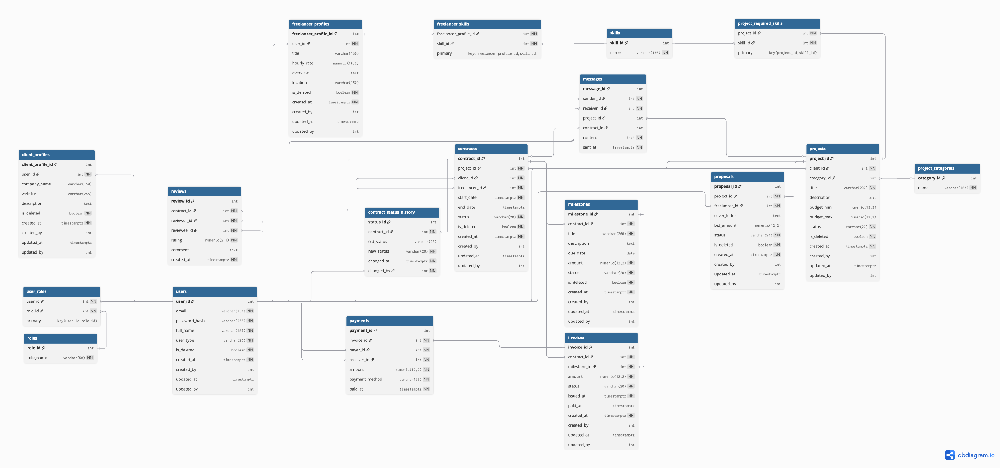

# Варіант №7: Інтернет-платформа для фрілансерів

---

Проєкт є реалізацією серверної частини інтернет-платформи для пошуку та виконання фріланс-проєктів.  
Робота виконана з використанням **Python** (патерни Repository та Unit of Work) та **PostgreSQL 18** як реляційної СУБД для зберігання даних і виконання бізнес-логіки (збережені процедури, тригери, функції, уявлення). :contentReference[oaicite:0]{index=0}

---

## 1–2. Схема бази даних

Спроєктовано реляційну схему бази даних, що моделює роботу фріланс-біржі: користувачі, профілі, навички, проєкти, пропозиції, контракти, фінансові операції та комунікація.

**Інструмент проєктування:** [dbdiagram.io](https://dbdiagram.io/)  
**Файл з діаграмою:** `lab1/diagram.png`

### Візуалізація схеми

> 


### Сутності (18 таблиць)

Схема містить **18 сутностей**, які логічно поділені на декілька груп:

* **Користувачі та ролі**
  * `users` – базова інформація про користувача (email, ПІБ, тип: `client` / `freelancer` / `admin`) + поля soft delete та аудиту.
  * `roles` – довідник ролей.
  * `user_roles` – зв’язок «багато-до-багатьох» між користувачами та ролями.

* **Профілі клієнтів і фрілансерів**
  * `client_profiles` – компанія, сайт, опис клієнта.
  * `freelancer_profiles` – заголовок профілю, погодинна ставка, overview, локація.
  * `skills` – довідник навичок.
  * `freelancer_skills` – зв’язок «фрілансер ↔ навичка».

* **Проєкти**
  * `project_categories` – категорії проєктів (Web, Design тощо).
  * `projects` – проєкти клієнтів (бюджет, опис, статус, soft delete, аудит).
  * `project_required_skills` – вимоги до навичок по кожному проєкту.

* **Пропозиції та контракти**
  * `proposals` – відгуки фрілансерів на проєкти (ставка, лист, статус, soft delete + аудит).
  * `contracts` – укладені контракти між клієнтом і фрілансером.
  * `contract_status_history` – історія зміни статусів контракту.

* **Фінанси**
  * `milestones` – етапи робіт за контрактом (сума, дедлайн, статус, soft delete + аудит).
  * `invoices` – інвойси по етапах (сума, статус, дати).
  * `payments` – фактичні платежі між користувачами.

* **Комунікація та відгуки**
  * `messages` – приватні повідомлення між користувачами (опційно прив’язані до проєкту/контракту).
  * `reviews` – відгуки та рейтинги після завершення контрактів.

---

## 3. Підтримка "Soft delete" та аудиту

### Soft Delete (м’яке видалення)

Для ключових сутностей використовується логічне видалення:

* **Поле:** `is_deleted BOOLEAN NOT NULL DEFAULT FALSE`
* **Основні сутності:**
  * `users`
  * `client_profiles`
  * `freelancer_profiles`
  * `projects`
  * `proposals`
  * `contracts`
  * `milestones`
  
Фізично запис не видаляється, а лише позначається як видалений. Для взаємодії з такими сутностями передбачені окремі збережені процедури, наприклад:

* `sp_soft_delete_project(p_project_id, p_user_id)`
* `sp_restore_project(p_project_id, p_user_id)`

### Аудит змін (updated_at / updated_by)

Для відстеження змін у важливих таблицях використовуються поля:

* `created_at TIMESTAMPTZ NOT NULL`
* `created_by INT`
* `updated_at TIMESTAMPTZ`
* `updated_by INT`

Автоматичне оновлення `updated_at` реалізовано через тригерну функцію:

* `update_timestamp()`  
  + тригери: `trg_users_set_updated_at`, `trg_projects_set_updated_at`, `trg_proposals_set_updated_at`, `trg_contracts_set_updated_at`, `trg_milestones_set_updated_at`.

---

## 4. Реалізація в СУБД PostgreSQL

Схема повністю реалізована в **PostgreSQL 18** (Postgres.app).  
SQL-скрипти знаходяться у папці `lab1/sql/`:

* `schema.sql` – створення таблиць, зв’язків, індексів, тригерів.
* `logic.sql` – користувацькі функції, збережені процедури, уявлення (VIEW) та тригери.
* `data.sql` – тестові дані для демонстрації сценарію.

Скрипти можуть виконуватись послідовно в будь-якій існуючій БД PostgreSQL (наприклад, `template1` або окремій навчальній БД).

---

## 5. Використання об’єктів БД (functions, procedures, triggers, views)

Бізнес-логіка частково винесена на рівень СУБД у вигляді функцій, процедур, тригерів та уявлень.

### Користувацькі функції

1. `fn_get_contract_total(p_contract_id INT) RETURNS NUMERIC`
   * Обчислює сумарну суму по контракту на основі оплачений milestones.
2. `fn_get_freelancer_rating(p_freelancer_id INT) RETURNS NUMERIC`
   * Обчислює середній рейтинг фрілансера за таблицею `reviews`.
3. `log_contract_status_change() RETURNS TRIGGER`
   * Тригерна функція, що логує зміну статусу контракту в таблиці `contract_status_history`.

### Збережені процедури (Stored Procedures)

1. `sp_create_project(p_client_id, p_category_id, p_title, p_description, p_budget_min, p_budget_max, p_created_by)`
2. `sp_soft_delete_project(p_project_id, p_user_id)`
3. `sp_restore_project(p_project_id, p_user_id)`
4. `sp_create_proposal(p_project_id, p_freelancer_id, p_cover_letter, p_bid_amount, p_created_by)`
5. `sp_accept_proposal(p_proposal_id, p_admin_id)`
   * Приймає пропозицію, відхиляє інші та створює контракт.
6. `sp_create_milestone(p_contract_id, p_title, p_description, p_due_date, p_amount, p_created_by)`
7. `sp_pay_milestone(p_milestone_id, p_payer_id, p_receiver_id, p_method)`
   * Створює інвойс і платіж, оновлює статус milestone та за потреби контракту.

### Тригери

* `trg_log_contract_status` – викликає `log_contract_status_change()` при зміні статусу контракту.
* `trg_*_set_updated_at` – набір тригерів `BEFORE UPDATE` для автоматичного оновлення поля `updated_at` у відповідних таблицях.

### Представлення (Views)

1. `v_open_projects`
   * Повертає лише відкриті та не видалені проєкти разом з категорією та клієнтом.
2. `v_freelancer_active_contracts`
   * Список активних контрактів конкретного фрілансера, включно із сумою контракту (через `fn_get_contract_total`).
3. `v_contract_details`
   * Детальна інформація по контракту: проєкт, клієнт, фрілансер, сума, рейтинг фрілансера.

У Python-коді **читання** даних виконується тільки через ці уявлення, а **зміни** – лише через збережені процедури.

---

## 6. Індекси (мінімум два різні типи)

Для оптимізації запитів створено кілька типів індексів:

### 1) B-Tree індекси (тип за замовчуванням)

* Первинні ключі та унікальні обмеження (`users_pkey`, `users_email_key`, `projects_pkey` тощо).
* Окремі індекси:
  * `idx_projects_client_id` – пошук проєктів клієнта.
  * `idx_projects_status` – фільтрація за статусом.
* Частковий b-tree індекс:
  * `idx_projects_open` – індексує лише рядки, де `status = 'open'` і `is_deleted = FALSE` (оптимізує вьюху `v_open_projects`).

### 2) GIN індекс

* `idx_projects_search` – GIN-індекс на `to_tsvector(title || ' ' || description)` для повнотекстового пошуку по проєктах.

### 3) HASH індекс

* `idx_users_email_hash` – hash-індекс по `users(email)`, який демонструє використання альтернативного до b-tree механізму доступу.

Таким чином у проєкті використано **щонайменше три різні типи індексів**: `btree`, `gin`, `hash`.

---

## 7. Робота з БД з коду (Repository + Unit of Work)

Уся взаємодія з БД з боку Python коду організована через комбінацію патернів **Repository** та **Unit of Work**.  
Усі запити до БД:

* **на запис** – лише через збережені процедури (`CALL sp_*`),  
* **на читання** – лише через уявлення (`SELECT * FROM v_*`).

### Структура проєкту

```text
lab1/
├── db/                     # (за потреби можна зберігати локальні налаштування)
├── py/
│   ├── base_repository.py  # Базовий клас репозиторію (общі методи)
│   ├── connection.py       # Створення підключення до PostgreSQL (psycopg2)
│   ├── contract_repository.py  # Робота з контрактами, milestones, платежами
│   ├── project_repository.py   # Робота з проєктами та пропозиціями
│   ├── unit_of_work.py     # Клас UnitOfWork (керує транзакцією)
│   ├── main.py             # Демонстраційний сценарій використання
│   └── requirements.txt    # Python-залежності
└── sql/
    ├── schema.sql          # Створення структури БД
    ├── logic.sql           # Функції, процедури, тригери, представлення
    ├── data.sql            # Початкові тестові дані
    └── diagram.png         # ER-діаграма
